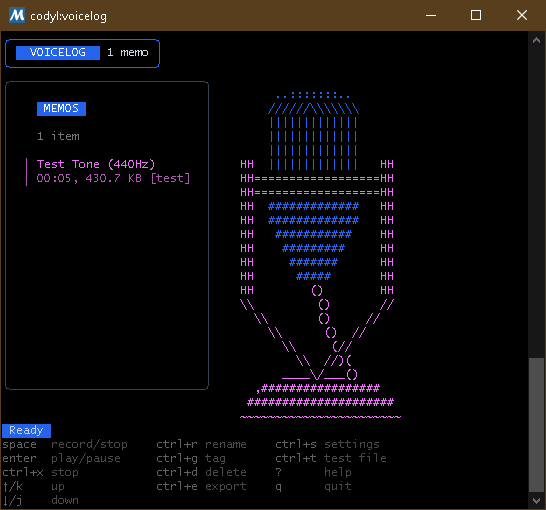
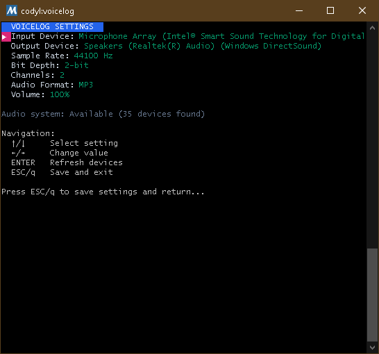

# VoiceLog

[](https://goreportcard.com/report/github.com/Cod-e-Codes/voicelog)
[](https://github.com/Cod-e-Codes/voicelog/actions/workflows/ci.yml)

A terminal-based voice memo application built with Go and Bubble Tea.

**Current Version: v1.0.8** - Latest release with real-time waveform visualization and audio processing features.

## Screenshots

### Main Screen
The main interface showing the memo list, ASCII art speaker visualization, and help information.



### Settings Screen
Audio configuration interface displaying hardware/audio settings, available devices, and help.



## Features

### Audio Recording and Playback
- Record audio using PortAudio with real-time waveform visualization
- Playback with real-time controls and waveform display
- WAV file format support with automatic post-processing
- Configurable audio devices and settings
- Test tone generation (440Hz sine wave)
- Real-time clipping detection with visual warnings
- Automatic silence trimming and audio normalization

### Memo Management
- List view with navigation
- Rename memos
- Add tags for organization
- Delete memos
- Export memos to Downloads folder
- **Optional transcription** with multiple provider support

### User Interface
- Terminal user interface using Bubble Tea
- Keyboard navigation
- Settings screen for audio configuration and processing options
- Help screen with keybindings
- ASCII art speaker visualization with two-tone coloring
- Professional color scheme with rounded borders
- Adaptive layout with real-time audio visualizer
- Real-time peak level meters and VU meters during recording

## Installation

### Pre-built Releases

Download the latest release from [GitHub Releases](https://github.com/Cod-e-Codes/voicelog/releases):

- **Windows (amd64)**: `voicelog-v1.0.8-windows-amd64.zip`
- **Linux (amd64)**: `voicelog-v1.0.8-linux-amd64.tar.gz`

#### Windows Installation
1. Download `voicelog-v1.0.8-windows-amd64.zip`
2. Extract the archive
3. Run `voicelog-windows-amd64.exe`

#### Linux Installation
1. Download `voicelog-v1.0.8-linux-amd64.tar.gz`
2. Extract: `tar -xzf voicelog-v1.0.8-linux-amd64.tar.gz`
3. Install PortAudio: `sudo apt-get install libportaudio2`
4. Run: `./voicelog-linux-amd64`

### Build from Source

#### Prerequisites
- Go 1.25 or later
- PortAudio development libraries

#### Windows (MSYS2)
```bash
pacman -S mingw-w64-x86_64-portaudio
```

#### Linux (Ubuntu/Debian)
```bash
sudo apt-get install libportaudio2 portaudio19-dev
```

#### Build and Run
```bash
# Clone the repository
git clone https://github.com/Cod-e-Codes/voicelog.git
cd voicelog

# Download dependencies
go mod download

# Build the binary
go build -o voicelog main.go

# Run
./voicelog
```

## Usage

### Keybindings

| Key | Action |
|-----|---------|
| `SPACE` | Start/Stop recording |
| `ENTER` | Play/Pause selected memo |
| `↑/↓` | Navigate memo list |
| `ctrl+r` | Rename memo |
| `ctrl+g` | Add tag |
| `ctrl+d` | Delete memo |
| `ctrl+e` | Export memo |
| `ctrl+x` | Stop playback |
| `?` | Show help |
| `ctrl+s` | Settings |
| `ctrl+t` | Transcribe selected memo |
| `F5` | Generate test file |
| `ESC/q` | Quit |

### Basic Operations

1. **Recording**: Press `SPACE` to start/stop recording
2. **Playback**: Select a memo and press `ENTER` to play
3. **Transcription**: Press `ctrl+t` to transcribe selected memo (optional)
4. **Settings**: Press `ctrl+s` to configure audio devices and transcription
5. **Test File**: Press `F5` to generate a 5-second 440Hz test tone
6. **Export**: Press `ctrl+e` to export selected memo to Downloads folder

### Audio Processing Features

VoiceLog includes advanced audio processing capabilities:

#### Real-Time Visualization
- **Waveform Display**: Live waveform visualization during recording and playback
- **Peak Level Meters**: Monitor input levels with color-coded peak indicators (during recording)
- **VU Meters**: Left/right channel level monitoring (during recording)
- **Clipping Detection**: Visual warnings when audio levels exceed thresholds (during recording)

#### Automatic Post-Processing
- **Silence Trimming**: Automatically removes silence from beginning and end of recordings
- **Audio Normalization**: Amplifies recordings to optimal levels (configurable target)
- **Configurable Thresholds**: Adjust silence detection and clipping thresholds in settings

#### Adaptive Interface
- **Smart Layout**: Interface adapts during recording/playback to show visualizer
- **Compact Mode**: Memo list becomes compact when audio visualizer is active
- **Real-Time Updates**: Waveform and meters update in real-time during operation

### Transcription (Optional)

VoiceLog supports optional voice-to-text transcription through a flexible plugin system. Transcription is **completely optional** - the application works perfectly without it.

#### Supported Transcription Providers

1. **whisper.cpp (Recommended - Local & Private)**
   - High accuracy, supports many languages
   - Runs entirely offline - no internet required
   - Complete privacy - audio never leaves your machine
   - Installation: [github.com/ggerganov/whisper.cpp](https://github.com/ggerganov/whisper.cpp)

2. **OpenAI Whisper API (Cloud-based - Highest Accuracy)**
   - Highest accuracy available
   - Requires internet connection and API key
   - Install: `pip install openai`
   - Set `OPENAI_API_KEY` environment variable

3. **Vosk (Lightweight & Fast)**
   - Smaller models, faster processing
   - Good for real-time applications
   - Installation: [alphacephei.com/vosk](https://alphacephei.com/vosk/)

4. **Custom Python Script**
   - Use any transcription API (AssemblyAI, Rev.ai, etc.)
   - Write your own integration script
   - Full flexibility for custom workflows

#### Quick Setup Examples

**whisper.cpp Setup (Linux/macOS):**
```bash
# Clone and build whisper.cpp
git clone https://github.com/ggerganov/whisper.cpp
cd whisper.cpp && make

# Download a model (base.en for English, base for multilingual)
./models/download-ggml-model.sh base.en

# The whisper binary will be auto-detected by VoiceLog
```

**OpenAI Whisper API Setup:**
```bash
# Install the OpenAI library
pip install openai

# Set your API key (get one from https://platform.openai.com)
export OPENAI_API_KEY="your-api-key-here"
```

#### Using Transcription

1. **Enable in Settings**: Press `ctrl+s` → Navigate to "Transcription:" → Toggle to ON
2. **Select Provider**: Navigate to "Default Provider:" → Choose your installed provider
3. **Transcribe**: Press `ctrl+t` on any memo to transcribe it
4. **Auto-Transcribe**: Enable "Auto Transcribe:" to automatically transcribe new recordings

#### Transcription Features

- **Visual Indicators**: Transcribed memos show a 📝 icon in the memo list
- **Search Integration**: Search through transcribed text using the built-in filter
- **Provider Status**: Settings show ✓/✗ status for each provider's availability
- **Flexible Configuration**: Each provider can be configured independently
- **Auto-Detection**: VoiceLog automatically detects available transcription tools

#### Privacy & Performance

- **Local Options**: whisper.cpp and Vosk run entirely on your machine
- **Cloud Options**: OpenAI Whisper API provides highest accuracy but requires internet
- **No Telemetry**: VoiceLog never sends any data anywhere (except when using API providers)
- **Storage**: Transcriptions are stored locally alongside memo metadata

## Configuration

Configuration is stored in `~/.voicelog/config.json` and includes:
- Audio device settings
- Sample rate and format preferences
- Audio processing settings (normalization, silence trimming, clipping detection)
- Transcription settings (optional)
- Memo storage path
- Keybindings

### File Structure
```
~/.voicelog/
├── config.json          # Application configuration
├── transcription.json   # Transcription settings (if enabled)
├── memos/               # Voice memo storage
│   ├── metadata.json    # Memo metadata (includes transcriptions)
│   └── memo_*.wav       # Audio files
└── voicelog.log         # Application logs
```

## Technical Details

Built with:
- **[Bubble Tea](https://github.com/charmbracelet/bubbletea)** - TUI framework
- **[PortAudio](https://github.com/gordonklaus/portaudio)** - Audio I/O
- **Go** - Programming language

## Known Issues

### Audio Device Problems
- **WSL (Windows Subsystem for Linux)**: ALSA errors occur due to missing audio device access. WSL doesn't provide direct access to Windows audio devices.
- **Windows Standalone**: Missing `libportaudio.dll` when running the pre-built binary outside of MSYS2 environment.
- **Recording Issues**: Audio recording may not work properly in some environments, though playback and device detection work correctly.

### Workarounds
- **For WSL**: Use the Windows version instead, as WSL doesn't support direct audio device access.
- **For Windows**: Run from MSYS2 environment or ensure PortAudio libraries are properly installed.
- **For Linux**: Ensure you have proper audio device permissions and ALSA/PulseAudio configured.

## Contributing

This project is a work in progress and contributions are welcome! If you encounter issues or have improvements to suggest, please:

1. Check existing issues on GitHub
2. Create a new issue with detailed information about your environment
3. Submit pull requests for bug fixes or new features

## License

This project is licensed under the MIT License - see the [LICENSE](LICENSE) file for details.
